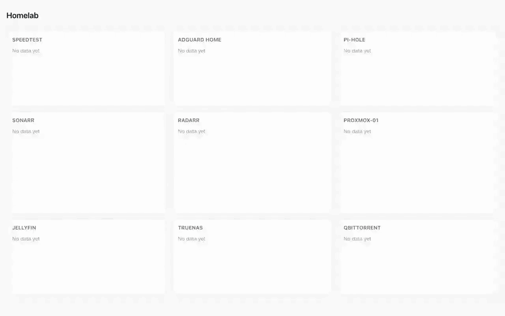
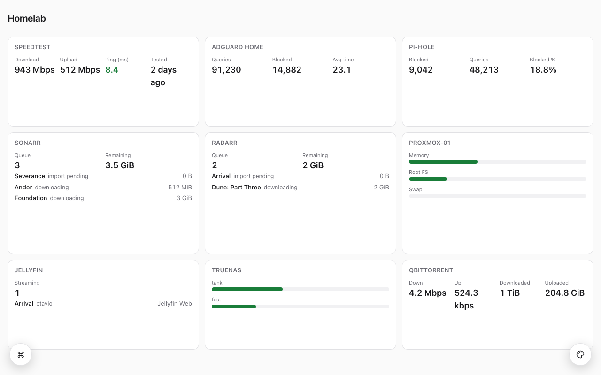
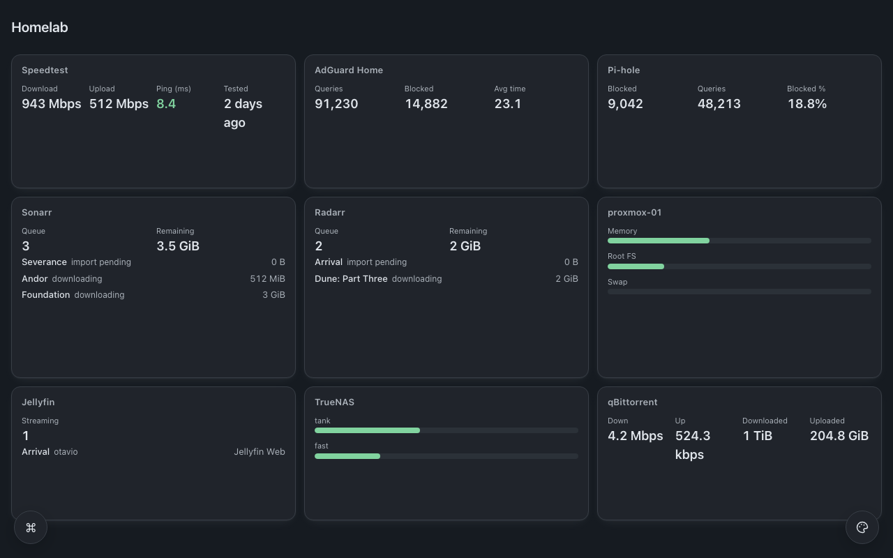
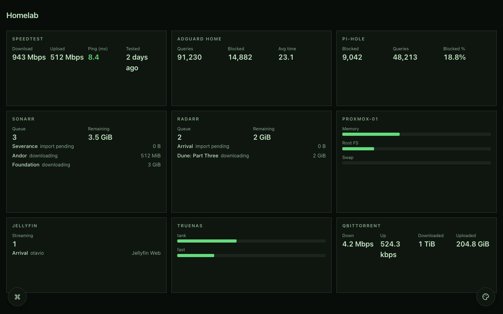

<div align="center">


# neohomepage

**A self-hosted start page for your homelab that you configure in the browser — not by editing YAML and restarting a container.**

[](https://github.com/oauramos/neohomepage/actions/workflows/ci.yml)
[](https://oauramos.github.io/neohomepage/)
[](LICENSE)
[](.nvmrc)

[Documentation](https://oauramos.github.io/neohomepage/) ·
[Install](https://oauramos.github.io/neohomepage/install) ·
[Widgets](https://oauramos.github.io/neohomepage/widgets/) ·
[Wiki](https://github.com/oauramos/neohomepage/wiki) ·
[Report a problem](https://github.com/oauramos/neohomepage/issues/new/choose)

</div>

---

## The gap this fills

[gethomepage](https://gethomepage.dev) has around 160 service integrations and no way to add one
without editing a YAML file. [Homarr](https://homarr.dev) has a real visual editor and around 40
integrations, and wants Redis, SQLite and roughly 500 MB of RAM.

Nobody combines the integration breadth of the first with the editing experience of the second, in
something that fits a 1 GB box. That is the whole idea.

## What it does

- **Everything is editable in the browser.** A button in the bottom-left corner opens the editor:
  drag widgets around, change the theme, set a background, add a service by filling in a form.
  There is no configuration file you are expected to edit.
- **Your data is a folder of JSON.** `git init` it, push it, and restoring on a new machine is
  `git clone` plus your credentials in the environment. That claim is executed in CI, not asserted.
- **It is small.** One Node process. No database, no Redis, no bundler on the box. The dashboard is
  rendered to static HTML and served from disk — 46 MB resident, 61 MB of image.
- **It works with JavaScript disabled.** The published page is a document. The editor is the only
  part that needs a script, and it is loaded only when you open it.
- **Widgets are data, not code.** Each integration is a JSON manifest. The edit form, the MCP tool
  schema, the egress allowlist and the documentation are all derived from it, so they cannot drift.
- **An AI can configure it.** A built-in MCP server lets Claude, Codex or any MCP client add
  widgets and services for you — without ever being able to read a credential or name a URL.

## See it work

**Changing how it looks.** Scheme, preset, then corner radius on a slider — the board repaints
under the panel as you drag it. No reload, no restart, no file to edit.



**Moving things around.** Edit mode, one tile dragged by its handle, and the grid reflowing around
it. The layout is written when you let go.


<details>
<summary><b>Three of the seven presets, full size</b></summary>





</details>

Neither clip is a mockup. `pnpm demo:record` boots the real server on a throwaway data directory in
front of one stub per widget, each answering with that widget's own recorded fixture — the same
JSON the catalog tests assert against — so every number on screen arrived through the real fetcher,
decoder and projection. The pointer is drawn in, because a screen recorder does not capture one.

## Quick start

```sh
mkdir neohomepage && cd neohomepage
curl -O https://raw.githubusercontent.com/oauramos/neohomepage/main/compose.yaml
docker compose up -d
```

Open `http://<this-host>:7575`. Add a service from the button in the bottom-left corner.

<details>
<summary><b>From source</b></summary>

Requires Node ≥ 24.15 and pnpm.

```sh
git clone https://github.com/oauramos/neohomepage
cd neohomepage
pnpm install
pnpm dev
```

Open <http://localhost:5173>. This is the same code the container runs: the image ships the
sources, not a compiled bundle.

</details>

## The security posture

> **The browser and the MCP server never name a URL, a path, a header or an HTTP method.**

A client asks to refresh a widget _by id_. The server resolves instance → service → manifest → a
literal path template with typed, encoded parameters, and then asserts that the URL it is about to
dial has exactly the origin and pathname it just computed. That equality check — not a character
blocklist — is what defeats forward-slash traversal, the backslash bypass, the `%23` fragment
trick, and the omitted-parameter early return that produced
[GHSA-669x-4pg4-w24r](https://github.com/gethomepage/homepage/security/advisories/GHSA-669x-4pg4-w24r).

Only projections are cached and sent. The raw upstream response is discarded before it reaches a
cache, so a hypothetical SSRF against a service's settings endpoint returns the three fields a
manifest declared and nothing else.

Credentials never enter the git-synced configuration. The server decides what is a credential from
the manifest — not from what the client called it — so there is no code path that writes one into
`config/`. There is a test that tries.

## What is checked, and how

Claims about self-hosted software are cheap, so the ones here are executable.

| Claim                                 | The check                                                                              |
| ------------------------------------- | -------------------------------------------------------------------------------------- |
| Widgets cannot drift from their forms | `requires` is derived from each manifest and compared against what the author declared |
| A widget works offline                | `catalog:test` makes `fetch` **throw**, not merely go unused                           |
| The catalog covers what it claims     | a coverage footer: templates 5/5, auth kinds 5/5, decoders 3/3                         |
| Two builds are byte-identical         | CI builds the catalog twice and compares                                               |
| The board works without JavaScript    | a Playwright profile with JS disabled                                                  |
| The editor works without a mouse      | a fixture that makes `page.mouse` throw                                                |
| The theme meets WCAG AA               | every text token against every surface, as colour maths                                |
| It fits on a 1 GB box                 | an hour-long soak on real arm64 under a 1 GiB cgroup                                   |
| Restore actually restores             | commit `/data`, clone it, boot with the key in the environment, compare hashes         |
| Nothing needed changing for Docker    | `git diff f12..HEAD -- 'packages/*/src/'` prints nothing                               |

## Architecture, briefly

```
config/*.json  ──resolve()──▶  state/resolved.json  ──publish()──▶  generations/000042/index.html
  sparse, yours              dense, derived           renderToStaticMarkup      served by GET /
```

`resolve()` is a pure function: sparse declarations plus manifest defaults produce one dense
evaluated tree. Publishing renders that to an immutable numbered generation and flips a pointer
atomically — so a failed render cannot serve a broken page, an upgrade can be rolled back, and
"undo what the AI did" is a pointer move.

The full reasoning is in [the documentation](https://oauramos.github.io/neohomepage/), including
[the memory budget](https://oauramos.github.io/neohomepage/architecture/memory) and
[the container](https://oauramos.github.io/neohomepage/architecture/container).

## Working on it

```sh
pnpm lint            # eslint, including the client/server boundary rule
pnpm typecheck
pnpm test            # the unit suite, both packages
pnpm e2e             # 28 browser tests: axe, keyboard-only editing, no-JS, tap targets
pnpm catalog:test    # every widget's projection against its fixtures, network blocked
pnpm budgets         # first boot, restart and publish latency at 60 widgets
pnpm drill           # the restore claim, executed: commit, clone, boot, compare
pnpm docs:dev        # the documentation site
```

`pnpm --filter @neohomepage/app neo --help` lists the command line. Every capability the UI has must
be reachable there first — that is what keeps each phase testable without a browser. `neo doctor`
explains anything wrong with an install and exits non-zero when it matters.

## The wiki

The [wiki](https://github.com/oauramos/neohomepage/wiki) is the operational half: symptoms and
their causes, where each service hides its API key, and the platform-specific things — NAS file
ownership, why `free -h` lies inside an LXC. Its pages live in [`wiki/`](wiki/) and are published
with `pnpm wiki:publish`, so a correction goes through review and cannot be lost with the wiki.

The [documentation site](https://oauramos.github.io/neohomepage/) is the reference half: install,
every widget, and why the thing is shaped this way. Two places, two jobs, and no paragraph in both.

## Contributing a widget

Three files and no code:

```
catalog/<slug>/manifest.json                  # the whole integration
catalog/<slug>/fixtures/<name>.upstream.json  # a recorded real response
catalog/<slug>/fixtures/<name>.expected.json  # the projection it must produce
catalog/<slug>/README.md                      # which vendor documentation you worked from
```

One service per pull request. A thirty-widget PR cannot have been written from thirty sets of
vendor documentation, and it cannot be reviewed. See
[the widget reference](https://oauramos.github.io/neohomepage/widgets/) for the full process.

## Status

F0–F13 are complete: the workspace, the arm64 memory experiment, the layout engine, the projection
DSL, the config kernel, the SSRF-safe fetcher, the poll scheduler, publishing, the SPA and its five
templates, the editor, authentication and MCP, the catalog and its sixteen widgets, accessibility
and hardening, and — last, on purpose — the container.

Next: the widgets against real hardware, and a tagged release.

## Licence and attribution

MIT. neohomepage is a clean-room implementation: gethomepage is GPL-3.0 and no code from it is used
here. Widget manifests are written from each vendor's own API documentation, with the source cited
in each widget's README.
